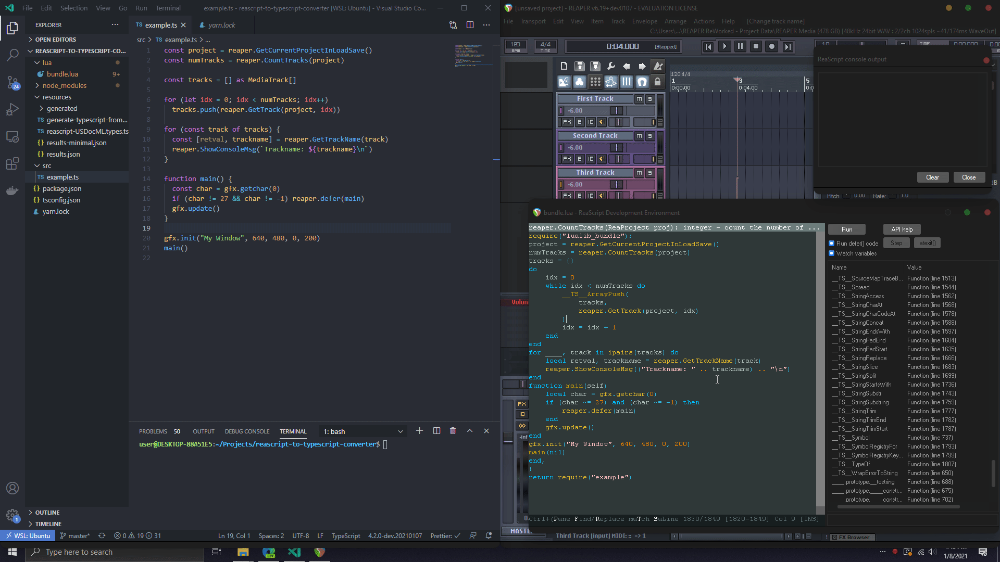

# Write Reaper scripts in Typescript/Javascript

**How it works:**

```
1. Mespotine ReaScript API Docs (USDocML)
2. API Docs to JSON (Lua script)
3. JSON to Typescript Definitions (Node.js Typescript script)
4. TypescriptToLua library
5. REAPER =)
```

**How to use this:**

1. Clone the repo
2. Run `yarn install` or `npm install`
3. Change the code in `./src/example.ts`, make multiple files and import them, do whatever
4. To have it automatically re-bundle to Lua when file saves are made, run `yarn dev` or `npm run dev`
5. To manually compile the Lua file, run `yarn build` or `npm run build`
6. Import this script like any regular ReaScript
   
You'll find the compiled lua file in `./lua/bundle.lua`

